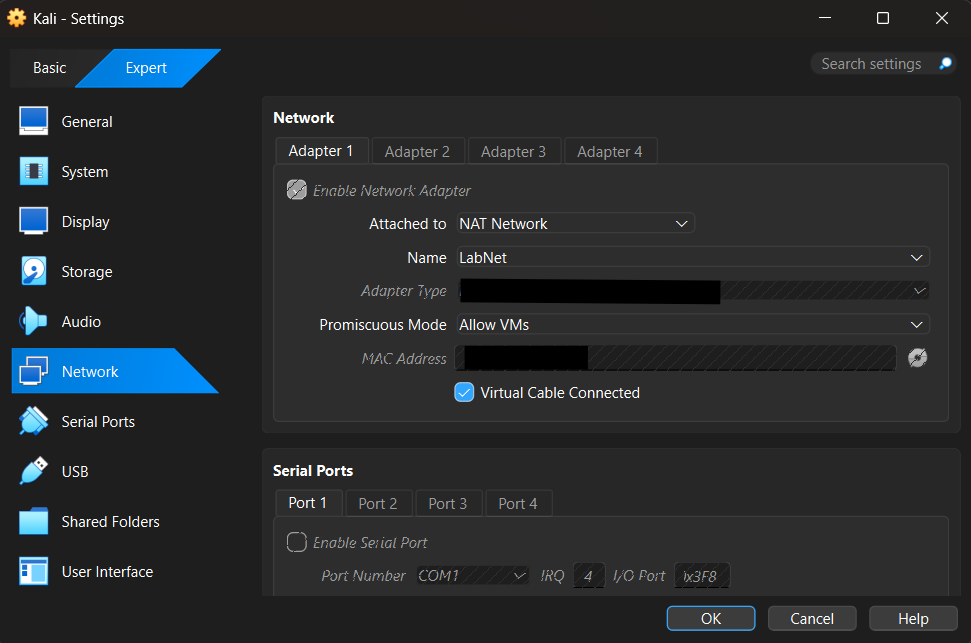
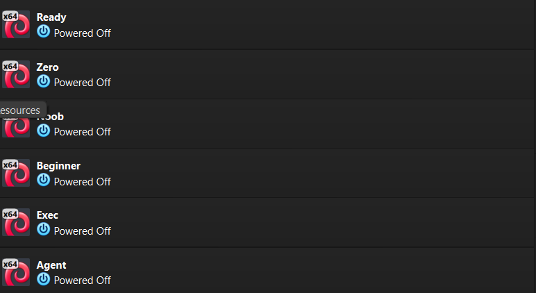
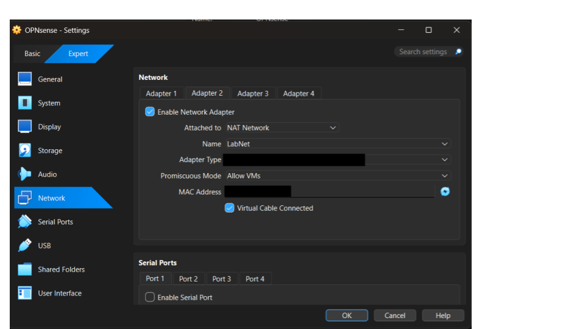

### Homelab-Intro-Project

## Overview 

This personal project will be explaining what I use to conduct safe and ethical hands on learning in a controlled environment such as my homelab. I'll touch on what virtual machines I use, architecture, configs, settings, etc.

This is just visual of all of the VM's that I have in my homelab as of right now, i'll add more to it throughout my cyberjourney. 

I have my kali machine ON the NAT Network setting which allows for it coomunicate with other VM's in my homelab and they aren't exposed to the real internet. I had made a new NAT Network called "Labnet" so it doesn't interfere with my ISP as I was having problems with this recently on my newest addition opnsense. I would try to visit an IP and it would direct me to an ISP page, which wasn't supposed to happen but when I created the labnet NAT Network and added all of the other VM's I was using to it as well, the problem was solved. This is where I spend most of my time, on the kali machine, which is why allocated the most memory and processors to this machine compared to any other.

I have the metasploitable3 machine on the Labnet NAT Network also to keep it away from the internet as it intentionally has vulnerable services so that it can be practiced on. This is always my target VM when i'm looking to practice pentesting techniques and things of that nature.

The ubuntu machine is also on the Labnet NAT Network kept away from the internet. I use it to just run scans against it for the most part.However when I was trying to create my first personal project I was using to mess around with firewalls via the ufw command, I'll try to incorporate this VM more into future projects.

I used my kali machine to scan both the ubuntu and metasploitable machines via the following commands: 
- ping -c 3 <metasploitable ip>
- ping -c 3 <ubuntu ip>

Results: The machines were up, meaning that they could be reached

**note**: This command is used to see if a machine is up and running and can be reached. The -c argument is used to specify how many packets we want to send to the machine that is being pinged. Lastly, the results say 3 packets were sent and 3 were received meaning that the host is up, had the host not been up, it would've said no packets were received.

I used my metasploitable machine to scan both the ubuntu and kali machines via the following commands: 
- ping -c 3 <kali ip>
- ping -c 3 <ubuntu ip>

I used my ubunntu machine to scan both the metasploitable and kali machines via the following commands: 
- ping -c 3 <kali ip>
- ping -c 3 <metasploitable ip>

All of the other VM's that you see are machines that I use for practice regarding CTF's. I root them and take notes on methodologies that I used to solve and then remove them from my homelab, ethical.

Opnsense is a firewall system where you can create different firewalls based on a various amount of rules. The setup for this is a bit different from the rest, 1 adapter has to be on the NAT while another adapter has to be on the Labnet NAT Network so that I can get access to the internet while also remaining in my homelab. I don't have much experience with opnsense and but I have been playing around with the creating firewall rules such as blocking incoming and outgoing traffic to my kali ip, i'm not going to go in depth regarding that as this is just a overview.

